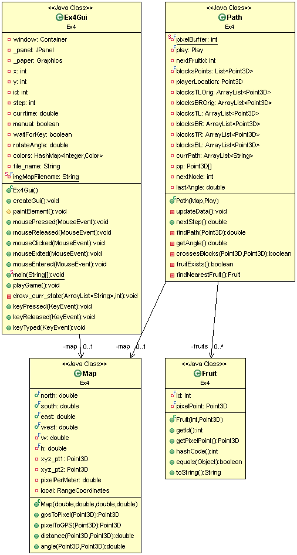

A pacman game implementation.

Run the Ex4Gui.java‬ file to start the game.

To select file press "start game", "load from CSV" and select your local CSV file.

To run in manual mode, press any arrow button before loading the game file. By default it will run in automatic mode using Dijkstra algorithm.
To select player initial location, press the location on the map before loading the game file. By default it will start from the top-left point of the map.

The system diagram:

My results on the 9 games are:
example1 : manual:  Play Report:Fri Jan 11 02:12:12 IST 2019 ,total time:88800.0 ,score:8.0, Time left:11200.0, kill by ghosts:0, out of box:0,
automatic: Play Report:Fri Jan 11 02:14:03 IST 2019 ,total time:73600.0 ,score:39.4, Time left:26400.0, kill by ghosts:0, out of box:0.
example2 : manual: Play Report:Fri Jan 11 02:20:06 IST 2019 ,total time:35000.0 ,score:69.0, Time left:65000.0, kill by ghosts:0, out of box:0, 
automatic: Play Report:Fri Jan 11 02:20:59 IST 2019 ,total time:33400.0 ,score:70.6, Time left:66600.0, kill by ghosts:0, out of box:0
.
example3 : manual: Play Report:Fri Jan 11 02:22:54 IST 2019 ,total time:93500.0 ,score:13.5, Time left:6500.0, kill by ghosts:0, out of box:0,
automatic: Play Report:Fri Jan 11 02:24:08 IST 2019 ,total time:64900.0 ,score:42.1, Time left:35100.0, kill by ghosts:0, out of box:0
.
example4 : manual: Play Report:Fri Jan 11 02:26:35 IST 2019 ,total time:37600.0 ,score:66.4, Time left:62400.0, kill by ghosts:0, out of box:0
, automatic: Play Report:Fri Jan 11 02:27:06 IST 2019 ,total time:29100.0 ,score:74.9, Time left:70900.0, kill by ghosts:0, out of box:0
.
example5 : manual: Play Report:Fri Jan 11 02:27:48 IST 2019 ,total time:29200.0 ,score:72.8, Time left:70800.0, kill by ghosts:0, out of box:0
, automatic: Play Report:Fri Jan 11 02:28:51 IST 2019 ,total time:27600.0 ,score:74.4, Time left:72400.0, kill by ghosts:0, out of box:0
.
example6 : manual: Play Report:Fri Jan 11 02:30:17 IST 2019 ,total time:100000.0 ,score:5.0, Time left:0.0, kill by ghosts:0, out of box:0
, automatic: Play Report:Fri Jan 11 02:30:56 IST 2019 ,total time:100000.0 ,score:9.0, Time left:0.0, kill by ghosts:0, out of box:0
.
example7 : manual:Play Report:Fri Jan 11 02:31:43 IST 2019 ,total time:36000.0 ,score:65.0, Time left:64000.0, kill by ghosts:0, out of box:0
, automatic: Play Report:Fri Jan 11 02:32:18 IST 2019 ,total time:34600.0 ,score:68.4, Time left:65400.0, kill by ghosts:0, out of box:0
.
example8 : manual: Play Report:Fri Jan 11 02:33:49 IST 2019 ,total time:100000.0 ,score:-134.0, Time left:0.0, kill by ghosts:3, out of box:87
, automatic: Play Report:Fri Jan 11 02:41:25 IST 2019 ,total time:100000.0 ,score:0.0, Time left:0.0, kill by ghosts:1, out of box:0
.
example9 : manual: Play Report:Fri Jan 11 02:42:48 IST 2019 ,total time:100000.0 ,score:-119.0, Time left:0.0, kill by ghosts:3, out of box:71
, automatic: Play Report:Fri Jan 11 02:43:24 IST 2019 ,total time:66700.0 ,score:2.299999999999997, Time left:33300.0, kill by ghosts:2, out of box:0
.

To compare with classmates, all data is available at https://liad.cloud/#one 
